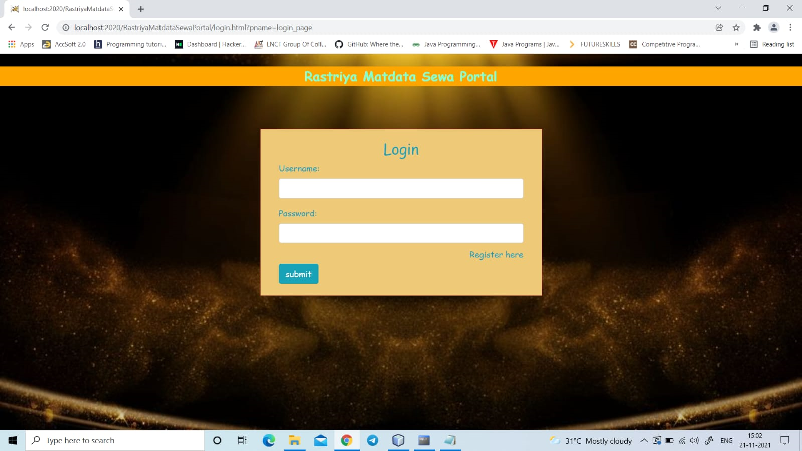

=============

:point_up_2:  NOTA  :negative_squared_cross_mark:
=============
About The Application :page_facing_up:
-------------
NOTA is a web-based application. The system has a centralized database to keep records of all the Voters and Candidates and Final Results. This web-based system is time saving, work load reduced information available at time and it provide security for the data. During the Voting, the Voting commission of the Voting has introduced a new method of polling by Online Voting system (OVS).

### Tech Stack :computer:
-----------
**Frontend:** HTML, CSS, Javascript  :airplane:

**Backend	:** JSP, Servlet, JDBC, Java  :boat:

**Database:** Oracle DB  :tractor:

### Objective :sparkles:  :rocket:
-------
- The objective of the system is a replacement of the traditional system that is in existence. This smart system reduces the time for Voting and also the system is reliable, and faster. Database maintained by this system usually contains the Voters information, Candidate information, The final Result of total votes.
- NOTA based on Aadhaar id uses Aadhaar id as key of authentication, system is efficient in terms of time and provides security the system is great improvement over traditional system. This system is quite robust; it takes care of authentication as well as security of voter's data stored in server. Through an online voting portal, we remove the risk of any spread of COVID-19.
- Moreover, people who aren' t physically present in their voting region for any reason, or those who cant travel physically to the polling booth both would benefit from this implementation

### Goal :soccer: 
-----
- **Planned approach towards working:** - The working in the organization will be well planned and organized. The data will be stored properly in data stores, which will help in retrieval of information as well as its storage.
- **Accuracy:** - The level of accuracy in the proposed system will be higher. All operation would be done correctly and it ensures that whatever information is coming from the center is accurate.
- **Reliability:** - The reliability of the proposed system will be high due to the above stated reasons. The reason for the increased reliability of the system is that now there would be proper storage of information.
- **No Redundancy:** - In the proposed system utmost care would be that no information is repeated anywhere, in storage or otherwise. This would assure economic use of storage space and consistency in the data stored.
- **Immediate retrieval of information:** - The main objective of proposed system is to provide for a quick and efficient retrieval of information. 
- **Immediate storage of information:** - In manual system there are many problems to store the largest amount of information.
- **Easy to Operate:** - The system should be easy to operate and should be such that it can be developed within a short period of time and fit in the limited budget of the user.

### The Challenge :fire:
-----
- The current voting system involves a lot of lengthy paper work procedures and requires voters to move to the polling stations in order to cast their vote. This lengthy process is tiresome and time consuming, which increases the rate of citizens absenteeism from voting. The NOTA e-Voting system therefore provides an easier way of voting that does not require ones physical presence in order to cast their vote.

- The COVID-19 pandemic made people – perhaps for the first time – consider if it is really worth it to leave their homes for many activities. Is picking the right apple at the grocery store worth the risk? As we near the Indian election, this same question remains, although the stakes are much higher. Constituents shouldnt have to agonize between choosing their health over casting a vote, or vice-versa, because there's a better solution. Its time for us to bring e-voting to the Indian people.

## Screenshots :camera:
--------
>  System Architecture  :dog:

> Home Page  :cat:

> Registration Page  :elephant:

> Login Page  :camel:

> Admin Home Page  :panda_face:

> Admin Options Page  :octopus:

> Manage User Page  :whale2:

> Manage Candidate Page  :tiger2:

> Add New Candidate Page :crocodile:

> Update Candidate  :penguin:

> Voting Page  :snowman:

> Results Page  :honeybee:

